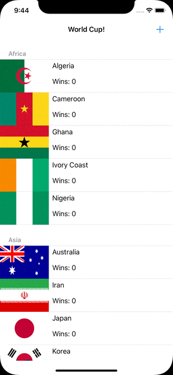

#  BGWorldCupApp

This is the World Cup Soccer app where on click of Cell row that team win according to App Logic, into this we used Core Data to Store team into it.

* Naigation top right **+** can we enable using shake gesture or clicking control + Command + Z into simulator
* We enable adding new team into tournament on clicking of + plus

## App Preview

<kbd>
 
</kbd>

<kbd>
 
</kbd>

#### we used ```NSFetchedResultsController``` of Core Data to Propagate data into TableView and 

```
lazy var fetchResultController: NSFetchedResultsController<Team> = {

        let fetchRequest: NSFetchRequest<Team> = Team.fetchRequest()

        let sortTeamNameDescriptor = NSSortDescriptor(key: #keyPath(Team.teamName), ascending: true)
        let sortZoneDescriptor = NSSortDescriptor(key: #keyPath(Team.qualifyingZone), ascending: true)
        let sortScoreDescriptor = NSSortDescriptor(key: #keyPath(Team.wins), ascending: false)

        fetchRequest.sortDescriptors = [sortZoneDescriptor, sortScoreDescriptor, sortTeamNameDescriptor]

        let fetchResultController = NSFetchedResultsController(fetchRequest: fetchRequest, managedObjectContext: coreDataStack.managedContext, sectionNameKeyPath: #keyPath(Team.qualifyingZone), cacheName: "worldCup")
        fetchResultController.delegate = self
        return fetchResultController

    }()
```

#### Delegate methods of ```NSFetchedResultsControllerDelegate``` used into it

```
func controllerWillChangeContent(_ controller: NSFetchedResultsController<NSFetchRequestResult>) 

func controller(_ controller: NSFetchedResultsController<NSFetchRequestResult>, didChange anObject: Any, at indexPath: IndexPath?, for type: NSFetchedResultsChangeType, newIndexPath: IndexPath?)

func controller(_ controller: NSFetchedResultsController<NSFetchRequestResult>, didChange sectionInfo: NSFetchedResultsSectionInfo, atSectionIndex sectionIndex: Int, for type: NSFetchedResultsChangeType)
        
func controllerDidChangeContent(_ controller: NSFetchedResultsController<NSFetchRequestResult>) 
```
